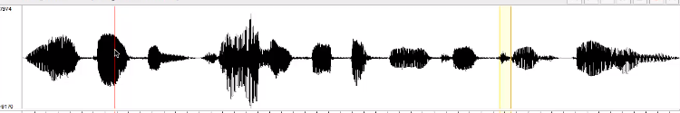

# Computational Linguistics (CL3.101)
## Summer 2021, IIIT Hyderabad
## 12 July, Monday (Lecture 20) – Speech Production

Taught by Prof. Anil Vuppala

## Speech Production (contd.)
### Physiology
Lungs form a source of air, which passes through the vocal cords (the excitation source) and enters the oral or nasal tract.  
The supra-glottal system (including the pharynx, oral cavity and nasal cavity) behaves as a time-varying resonator.

### Speech Signals
Speech signals consist of some regions of silence and some regions of speech.  
Speech may be voiced or unvoiced. Voiced parts are usually higher in intensity and have longer duration and a more regular waveform.  

When different people produce the same sound, we are able to perceive it as the same due to the formants being similar.
