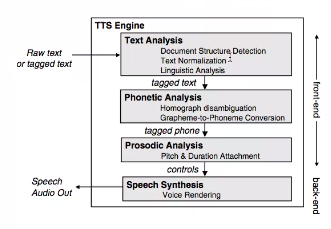

# Computational Linguistics (CL3.101)
## Summer 2021, IIIT Hyderabad
## 14 July, Wednesday (Lecture 22) – Speech Processing

Taught by Prof. Anil Vuppala

## Role of Linguists in Speech Processing
### Automatic Speech Recognition
Building an ASR system requires knowledge from diverse fields like phonology, phonetics, acoustics, etc. A language model is used to aid in phoneme prediction and identification.

### Text-to-Speech

